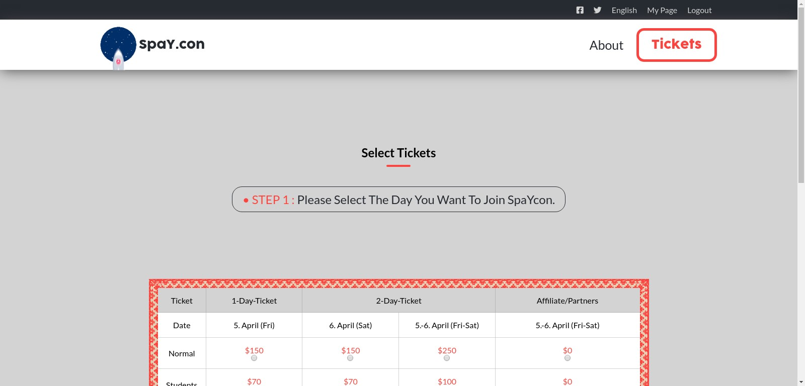

# Project Name

> Conference Page.

This Is A Conference Page.

## Built With

- HTML
- CSS
- SASS

## Live Demo

[Live Demo Link](https://raw.githack.com/Spayco/Conference-page/beta/index.html)

### Usage

- open index.html/about.html/tickets file

## Authors

👤 **SpaYco**

- Github: [@SpaYco](https://github.com/SpaYco)
- Twitter: [@iSpaYco](https://twitter.com/iSpaYco)
- Linkedin: [Aziz Mejri](https://www.linkedin.com/in/spayco/)

## Credits 
- Core Design By [Cindy Shin in Behance](https://www.behance.net/adagio07) (see [here](https://www.behance.net/gallery/29845175/CC-Global-Summit-2015))

## 🤝 Contributing

Contributions, issues and feature requests are welcome!

Feel free to check the [issues page](issues/).

## Show your support

Give a ⭐️ if you like this project!
## 📝 License

This project is [MIT](LICENSE) licensed.
